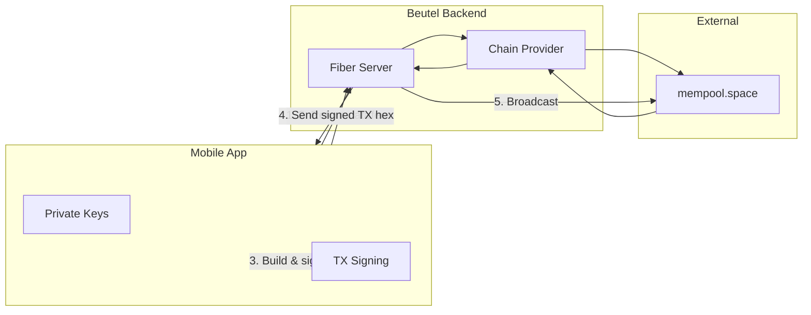

# beutel-backend

Thin proxy layer for the [Beutel Bitcoin Wallet](https://github.com/maindotmarcell/beutel-mobile). Abstracts chain data queries and transaction broadcasting while keeping all keys on the mobile device.

## Architecture



### Security Model (Non-Custodial)

| Stays on Mobile        | Handled by Backend     |
| ---------------------- | ---------------------- |
| Seed phrase / mnemonic | Public address queries |
| Private keys           | UTXO fetching          |
| Transaction signing    | Fee rate estimates     |
|                        | Broadcasting signed TX |

**Keys never leave the device.** The backend only sees public addresses and pre-signed transaction hex.

### Swappable Provider

The chain provider is abstracted behind an interface. Currently uses mempool.space, but can be swapped for:

- Electrum server
- Own Bitcoin node + indexer
- Other block explorers

## API Reference

### Health Check

```
GET /health
```

```json
{ "status": "ok", "network": "testnet4" }
```

### Get Balance

```
GET /v1/address/:address/balance
```

```bash
curl http://localhost:3000/v1/address/tb1qw508d6qejxtdg4y5r3zarvary0c5xw7kxpjzsx/balance
```

```json
{ "confirmed": 50000, "unconfirmed": 0, "total": 50000 }
```

### Get UTXOs

```
GET /v1/address/:address/utxos
```

```bash
curl http://localhost:3000/v1/address/tb1qw508d6qejxtdg4y5r3zarvary0c5xw7kxpjzsx/utxos
```

```json
[
  {
    "txid": "abc123...",
    "vout": 0,
    "value": 50000,
    "confirmed": true,
    "blockHeight": 123456
  }
]
```

### Get Transactions

```
GET /v1/address/:address/transactions
```

```bash
curl http://localhost:3000/v1/address/tb1qw508d6qejxtdg4y5r3zarvary0c5xw7kxpjzsx/transactions
```

```json
[
  {
    "txid": "abc123...",
    "confirmed": true,
    "blockHeight": 123456,
    "blockTime": 1704067200,
    "fee": 141
  }
]
```

### Get Fee Rates

```
GET /v1/fees
```

```bash
curl http://localhost:3000/v1/fees
```

```json
{
  "fastestFee": 12,
  "halfHourFee": 8,
  "hourFee": 4,
  "economyFee": 2,
  "minimumFee": 1
}
```

### Broadcast Transaction

```
POST /v1/tx/broadcast
```

```bash
curl -X POST http://localhost:3000/v1/tx/broadcast \
  -H "Content-Type: application/json" \
  -d '{"txHex": "0200000001..."}'
```

```json
{ "txid": "abc123def456..." }
```

## Configuration

| Variable  | Description     | Default   |
| --------- | --------------- | --------- |
| `PORT`    | Server port     | `3000`    |
| `NETWORK` | Bitcoin network | `mainnet` |

Supported networks: `mainnet`, `testnet3`, `testnet4`, `signet`

## Running

### Local Development

```bash
# Run on testnet4
NETWORK=testnet4 go run ./cmd/server

# Run on mainnet
NETWORK=mainnet go run ./cmd/server
```

### Docker

```bash
# Build and run
docker-compose up --build

# Run in background
docker-compose up -d

# View logs
docker-compose logs -f

# Stop
docker-compose down
```

Edit `docker-compose.yaml` to change the network:

```yaml
environment:
  - NETWORK=mainnet # or testnet3, testnet4, signet
```

## Project Structure

```
.
├── cmd/server/main.go       # Entry point
├── internal/
│   ├── api/
│   │   ├── handlers/        # HTTP handlers
│   │   └── router.go        # Route definitions
│   └── chain/
│       ├── provider.go      # Chain provider interface
│       └── mempool/
│           └── client.go    # mempool.space implementation
├── pkg/types/types.go       # Shared types
├── Dockerfile
├── docker-compose.yaml
└── go.mod
```

## Tech Stack

- **Go 1.22** - Fast, simple, great concurrency
- **Fiber v2** - Express-inspired web framework
- **mempool.space API** - Chain data provider
- **Docker** - Containerized deployment (~15MB image)

## License

MIT
